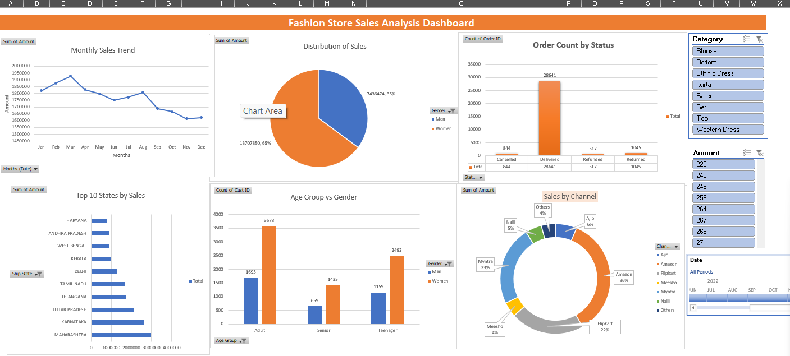

# Fashion Store Sales Analysis Dashboard

> 📊 An interactive sales analysis dashboard built using Microsoft Excel to analyze sales trends, customer demographics, order status, state-wise performance, and sales channels.

### 🛠️ Tech Stack

`Microsoft Excel` `Pivot Tables` `Pivot Charts` `Slicers` `Data Analysis` `Data Visualization`

---

## 📊 Project Overview

This project analyzes fashion store sales data and presents the findings through an interactive dashboard created using Microsoft Excel.

The dashboard helps understand sales trends, customer demographics, order status, state-wise performance, and sales channel distribution.

## 🎯 Objectives

- Analyze monthly sales trends
- Understand sales distribution by gender
- Analyze order status
- Identify top-performing states
- Compare different age groups and genders
- Analyze sales performance by channel
- Create an interactive and easy-to-understand dashboard

## 🛠️ Tools & Technologies

- Microsoft Excel
- Pivot Tables
- Pivot Charts
- Slicers
- Data Cleaning
- Data Analysis
- Data Visualization

## 📈 Dashboard Features

### Monthly Sales Trend
Analyzed monthly sales performance to identify changes and trends throughout the year.

### Sales Distribution by Gender
Compared sales contribution between male and female customers.

### Order Count by Status
Analyzed orders based on:
- Delivered
- Cancelled
- Refunded
- Returned

### Top 10 States by Sales
Identified the top 10 states based on total sales amount.

### Age Group vs Gender
Compared customer distribution across:
- Teenager
- Adult
- Senior

### Sales by Channel
Analyzed sales contribution from different channels including:
- Amazon
- Myntra
- Flipkart
- Ajio
- Meesho
- Nalli
- Others

## 🎛️ Interactive Filters

The dashboard provides interactive filters for:

- Category
- Amount
- Date

These filters allow users to analyze specific categories, price ranges, and time periods.

## 📷 Dashboard Preview

## 💡 Key Skills Demonstrated

- Data Cleaning
- Data Analysis
- Excel Pivot Tables
- Data Visualization
- Dashboard Development
- Business Insights
- Interactive Reporting

## 👩‍💻 Author

**Ashwini Santosh Vasatakar**

BE Computer Science & Engineering
